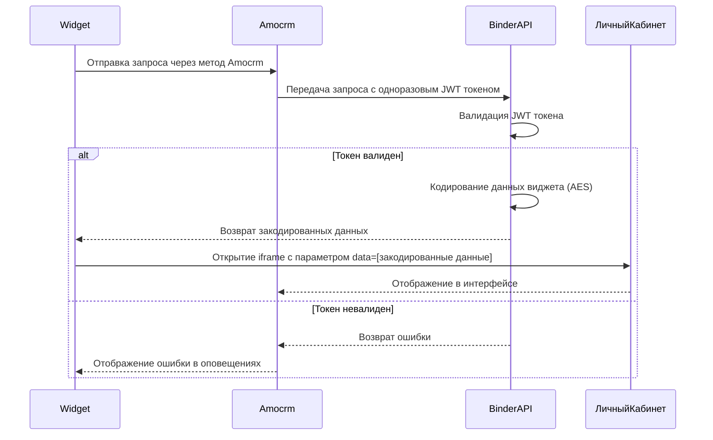

## Открытие личного кабинета в интерфейсе Amocrm

### Общий флоу открытия iframe

```mermaid
sequenceDiagram
    participant Widget
    participant Amocrm
    participant BinderAPI
    participant ЛичныйКабинет

    Widget->>Amocrm: Отправка запроса через метод Amocrm
    Amocrm->>BinderAPI: Передача запроса с одноразовым JWT токеном

    BinderAPI->>BinderAPI: Валидация JWT токена
    alt Токен валиден
        BinderAPI->>BinderAPI: Кодирование данных виджета (AES)
        BinderAPI-->>Widget: Возврат закодированных данных
        Widget->>ЛичныйКабинет: Открытие iframe с параметром data=[закодированные данные]
        ЛичныйКабинет-->>Amocrm: Отображение в интерфейсе
    else Токен невалиден
        BinderAPI-->>Amocrm: Возврат ошибки
        Amocrm-->>Widget: Отображение ошибки в оповещениях
    end
```